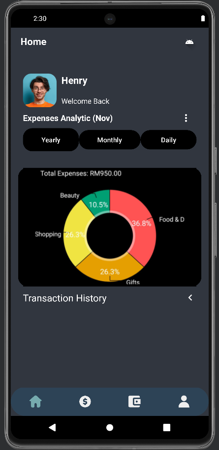
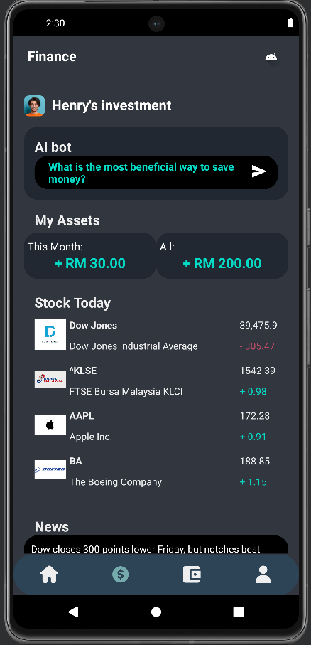
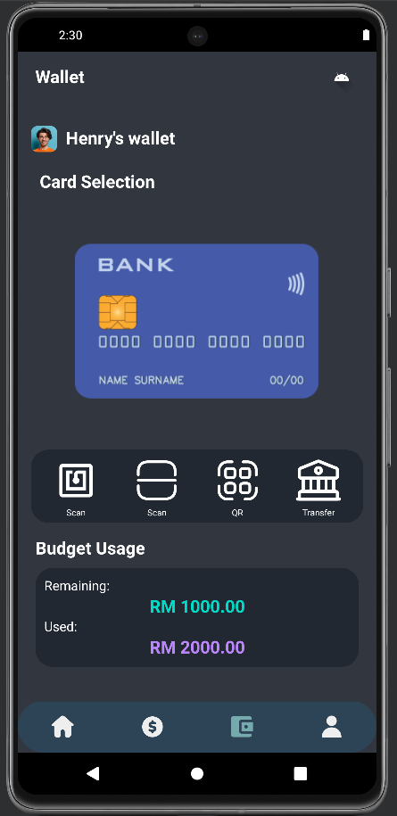
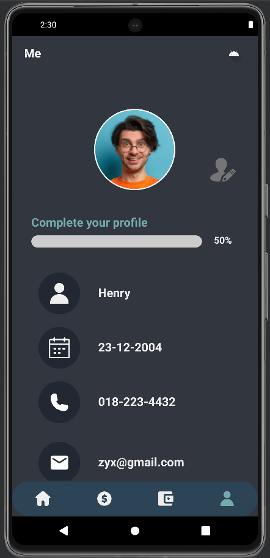

# Goblin Vault
Introducing our innovative mobile application, your ultimate multi-functional wallet and financial assistant. Say goodbye to the hassle of managing multiple apps for your financial needs – our all-in-one solution is here to simplify your life.

## Key Features
- Financial Literacy Helper
- Budget controller
- Multiple functions eWallet
- Expenses Recorder

## Modules
### Homepage
We have implemented the expenses record chart and transaction story that can show the users' expenses daily, monthly and yearly to provide a clear image to users about financial management. Users can know where they are spending a lot and try to reduce it.

### Financial Module
The financial module contains an AI bot that provides recommendations and guidance on financial literacy. This can help users to improve their knowledge about the investment strategy and financial risk. There is also an assets overview of users' earnings on investment. Next, we are providing a stock market view and live financial news so that users can know the latest financial news and trading trends.

### eWallet
After selecting the bank card to use, users can choose the transaction method they prefer including NFC, Scan QR or transfer manually. Users can also set their budget monthly, when their expenses exceed their budget users will be reminded via notification. At the same, users can check their remaining budget at the wallet interface.

### General Module
The general module is also developed for user authentication, and provides overview of users' details

